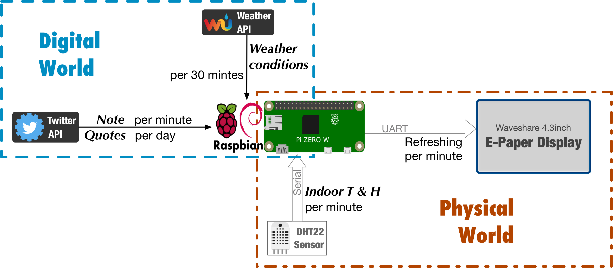
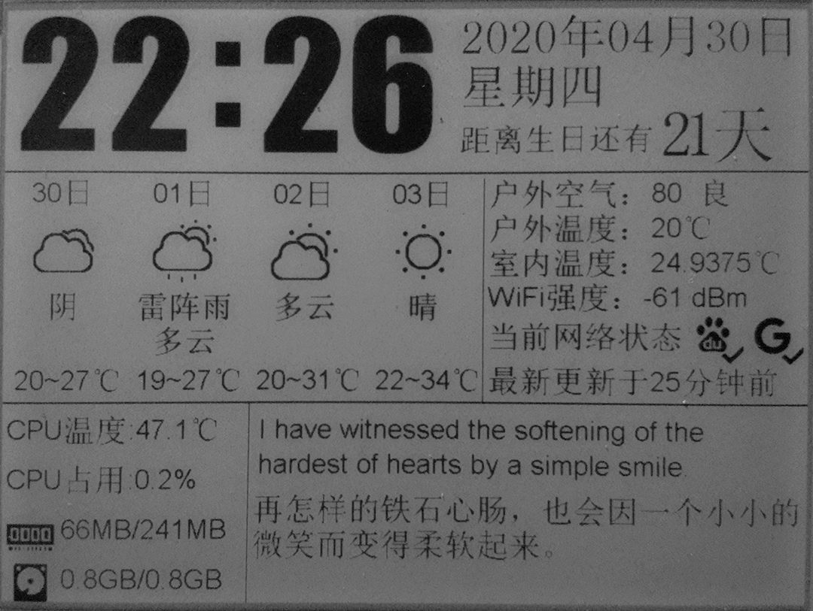

## Epaper-Display

### How to use

`sudo apt update && sudo apt install -y python3-wheel python3-pip python3-setuptools python3-psutil`
 
`git clone https://github.com/467815891a/Epaper-Display.git && cd Epaper-Display && sudo pip3 install -r requirements.txt` 

Then you can test the script by using `python3 main.py` 

And I also have a `epaper.service` file for systemd, you can change the script path in the `epaper.service` and enable the service by using 

`sudo cp epaper.service /etc/systemd/system && sudo systemctl daemon-reload && sudo systemctl enable epaper.service` 

#### v1.3
- Countdown function added back.
- Time digit font Updated. (New bitmap files added)
- Adapt the layout of date section.

##### Diagram

##### Layout

17 March 2018

#### v1.2
- Quotes-section added.
- Left-shifted right-hand section by 10 px.
- Fixed weather string bug(List index out of range when *weather* only contains 1 word e.g.'Clear').
- Altered encoding standard from *GB2312* to *GB18030*. 
- Altered the number of twitter statuses fetched each time, from 10 to 15.

15 March 2018

#### v1.1 
- Weather string truncated.
- Countdown fomula completed.
- Altered waiting time from 20sec into 30sec.
- Replaced countdown feature into twitter direct message.
- Two new modules imported: tweepy & textwrap.

11 March 2018

#### v1.0 Beta 

- weather: length unfixed
- Time: BMP file Dimensions unfixed
- Film section: TBA
- Book section: TBA
- Countdown fomula: TBA

3 March 2018
